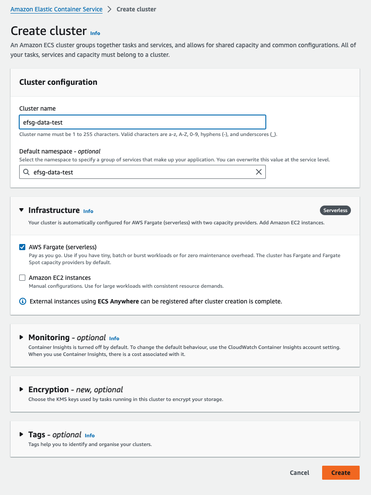

## Intro
I use Python + Selenium + Chrome to scrap data from Michael Kors website. The data will be then transformed into JSON and upload to S3. Below provides proposed soultion to deploy on AWS as well

## Tested Environment
1. [Notebook](app/scraper.ipynb) working in both ARM & Intel Macbook
2. Docker run only works in x86_64 machine

## Local Environment Setup (On Mac)
1. Please have Google Chrome installed on your laptop
2. Create an python virtual environment with `python -m venv venv` 
3. Prepare the working environment with 
   1. `source venv/bin/activate`
   2. `pip install -r requirements.txt`

## Local Run
- Jupyter Notebook
  1.  Create a kernel with venv you created above
  2.  Locate the notbook I've prepared [app/scraper.ipynb](app/scraper.ipynb) and Run ALL
  3.  You will get the result dataframe in the last cell

## Docker deployment
- The scraper is packed into the container as well as to ease deployment process
- Always deploy or test on x86 CPU architecture because of limitation on runing chrome in container environment under ARM CPU architecture

**Script testing in docker**
- Here's docker deployment steps:
  1. Build the container `docker build -t mk-bags .`
  2. Run the docker

## Proposed AWS deployment
**Architecture**

We could schedule run the container using either:
  1. Lambda + ECR
  2. ECS Fargate + ECR

Yet I highly recommend you take go approach #2 due to 15 min and caching limitation on Lambda.  The workflow is simple:
   1. Push ECR image to ECR repo
   2. Create Task definition in ECS
   3. Create ECS cluster for the job
   4. Create scheudle task under the ECS cluster

Pre-requisite:
- IAM user account with permission to upload docker layers
- IAM role with necessary permission to pull ECR and upload data to s3
- An new ECR repository called `mk-bags`
- VPC and subnets are well prepared

**1/ ECR Push**

Steps:
1. Logon the ECR repo with command provided on AWS portal `aws ecr get-login-password --region ap-southeast-1 | docker login --username AWS --password-stdin {account}.dkr.ecr.ap-southeast-1.amazonaws.com`
2. Tag the image `docker tag mk-bags:latest {account}.dkr.ecr.ap-southeast-1.amazonaws.com/mk-bags:latest`
3. Push to ECR `docker push {account}.dkr.ecr.ap-southeast-1.amazonaws.com/mk-bags:latest`

**2/ ECS Task Definition Setup**

1. Create Task defintion 
   1. Launch Type: Fargate
   2. OS: Linux/X86_64
   3. roles: A role who has ECR, Cloudwatch and S3 access
2. Copy the ECR url 
3. Create

**3/ ECS Cluster Set Up**

1. Create a ECS Cluster with desired name
2. Infrastructure: Fargate
3. (Optional) Recommended to turn on "Use Container Insights"

**4/ ECS Task Run**

1. head to the cluster you created in section #3
2. Test if the container works by "Run new task" under "Tasks" tab
3. Run a new task with below configs:
   1. Launch type: FARGATE
   2. Application Type: Task
   3. Family: Refer to section #2
4. Configurate Network setting probably
   
5. Create
6. A task will be created under "Tasks" section 
   
7. Click into the task and check the log if the scraper is working!
   

**4.1/ ECS Task Schedule Run**

1. Once step 4 has been tested successfully, you may create a schedule task in Cluster page
   
2. Set the interval between runs 
3. Follow section #4 and fill the task details
4. Done

**5/ Data Check**

1. By default, data will be uploaded to S3
2. You can either create a table and query the data using athena
